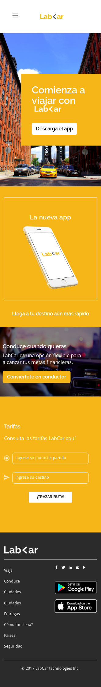
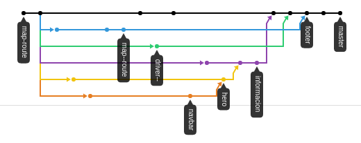

# Joined-LabCar
_Proyecto Final | Sprint 4_

## Tareas

1. **Navbar**
  - _**Desktop**_
    - [x] Logo y opciones
  - _**Mobile**_
    - [x] Menú desplegable con las opciones.
2. **Hero**
  - _**Desktop**_
    - [x] Imágen de fondo y opción de registrarse
  - _**Mobile**_
    - [x] Sale la opción para descargar el app
3. **Información**
  - _**Desktop**_
    - [x] Información acerca de la aplicación
  - _**Mobile**_
    - [x] La información se esconde y aparece un título y nuevo 
    texto debajo del contenedor del celular
4. **Conductor**   
  - _**Desktop**_
    - [x] Imágen de conduce y contenido a la derecha
  - _**Mobile**_
    - [x] El contenido unicado a la derecha pasa a ocupar todo el ancho
5. **Tarifa**
  - _**Desktop**_
    - [x] Dos input para agregar el punto de partida y otro para el destino
    - [x] Botón de trazar ruta
    - [x] Mostrar el Google Maps
  - _**Mobile**_
    - [x] No se muestra el mapa
6. **Footer**
  - _**Desktop**_
    - [x] Logo
    - [x] Dos columnas con enlaces
    - [x] Sociales
    - [x] Plataformas disponibles para la aplicación
    - [x] Copyright
  - _**Mobile**_
    - [x] Desaparece un bloque de links
    - [x] Sociales a la derecha
    - [x] Plataformas debajo de sociales
    
## Hacker Edition
- [x] Trazar ruta entre los puntos escritos en los input
- [x] Estimar la tarifa en base a a distancia entre los puntos 
(valor por Km: S/. 2.00)

## Secciones
  La web de LabCar está conformada por: 

1. Navbar
2. Hero
3. Información
4. Conduce
5. Tarifa
6. Footer

## Bootstrap
>Bootstrap es un framework desarrollado y liberado por Twitter que tiene como objetivo facilitar el diseño web. Permite crear de forma sencilla webs de diseño adaptable, 
>es decir, que se ajusten a cualquier dispositivo y tamaño de pantalla y siempre se vean igual de bien.

### ¿Qué es una API?
>Es una “llave de acceso” a funciones que podemos utilizar 
>de un servicio web provisto por un tercero, dentro de nuestra propia aplicación web, de manera segura y confiable.

## Google Api
1. **Obtener una clave de API:** Activar la Maps JavaScript API 
y cualquier servicio relacionado

``` javascript
<script src="https://maps.googleapis.com/maps/api/js?key=YOUR_API_KEY&callback=initMap" 
async defer></script>
```
2. **Mostrar mapa** 

  - Crear un `<div>` con el id="map"
``` HTML
<div id="map"></div>
```
  - Función en JavaScript: La función crea un mapa en el elemento `<div>`
  
 ```javascript
 function initMap() {
  var map = new google.maps.Map(document.getElementById('map'), {
    zoom: 8,
    center: {lat: 35.717, lng: 139.731}
  });
}
```

3. **Función autocompletar:** Muestra sugerencias de ubicaciones, autocompletándolas.

```javascript
(navigator.geolocation)? navigator.geolocation.getCurrentPosition(seePosition): containerMap.innerHTML = "Geolocalización no es soportado por tu navegador";
  autocompleteInput();
```

```javascript
function autocompleteInput(){
  new google.maps.places.Autocomplete(inpOrigin);
  new google.maps.places.Autocomplete(inpDestiny);
}
```
4. **Trazar ruta**
```javascript
  function showRoute(){
  var directionsService = new google.maps.DirectionsService;
  var directionsDisplay = new google.maps.DirectionsRenderer({map: map});
  var request = {
    origin: inpOrigin.value,
    destination: inpDestiny.value,
    travelMode: "DRIVING",
  };
  directionsService.route(request, function(response, status){
    if(status === 'OK'){
      directionsDisplay.setDirections(response);
      marker.setMap(null);
      rateForTravel(response);
    }else{
      window.alert("No encontramos una ruta.");
    }
  })
}
```

5. **Calcular Tarifa por Km**

```javascript
function rateForTravel(response){
  var distFromOriginToDest = response.routes[0].legs[0].distance.text.replace('km', '').replace(',', '.');
  var rate = distFromOriginToDest*2;
  var totalRate = document.getElementById("total-rate");
  totalRate.innerHTML = (rate > 5)? "S/. " + parseInt(rate): "S/. 5";
}
```

## Vista Mobile

## Vista Desktop


Mira cómo quedó haciendo click [aquí](https://lesashley.github.io/Joined-LabCar/).

## Network Graph  


## Team Joined Coders

<a href="https://github.com/dianaVidalC"></a> |
<a href="https://github.com/Fiorellacr24"></a>
<a href="https://github.com/lesashley"></a>
<a href="https://github.com/mishrole"></a>
<a href="https://github.com/ely405"></a>
<a href="https://github.com/aydasulca"></a>
|---|---|---|---|---|---|
[Erika Vidal](https://github.com/dianaVidalC) | [Fiorella Cisneros](https://github.com/Fiorellacr24/) | [Leslie Avendaño](https://github.com/lesashley)| [Mitch Rodríguez](https://github.com/mishrole) | [Ely Condori](https://github.com/ely405)| [Ayda Sulca](https://github.com/aydasulca)
